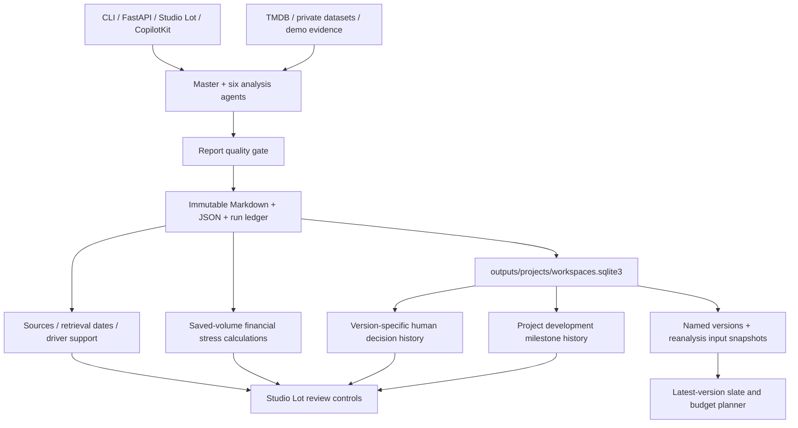

# 🏗️ Architecture Documentation

## System Overview

The current implementation uses the Anthropic Python SDK directly for six
specialized agents plus master synthesis. CLI, FastAPI classic UI, Studio Lot,
and the optional CopilotKit decision room share the analysis backend. TMDB and
local private datasets supply comparable evidence; no MCP server is wired.

## Current Workflow And Storage



| Module | Responsibility |
| --- | --- |
| `utils/project_workspaces.py` | SQLite projects, numbered report links, version-specific producer decisions, project-wide milestone snapshots derived from append-only events |
| `utils/evidence_provenance.py` | Conservative source labels, missing evidence warnings, exact-calculation driver links; no invented citations |
| `utils/financial_stress.py` | Saved demand/value stress, fixed license value, changed cost exposure and break-even, existing risk-tolerance thresholds |
| `utils/slate_planner.py` | Latest-version selection, cap/coverage/concentration checks, ranked greedy suggestions and exposure-weighted scenarios |
| `web/project-tools.js` | Studio Lot milestone, provenance and stress controls |
| `web/slate-planner.*` | Local portfolio planning and JSON download |

### Boundaries

- Analysis execution is async orchestration, but provider calls currently use
  the synchronous Anthropic client. Jobs and SSE event buffers are in memory;
  they do not survive a backend restart.
- Reports are written once under unique filenames. SQLite stores metadata and
  confidential reanalysis input snapshots, not an alternative report format.
- Producer decisions are exact-version records. New versions do not inherit
  approval; saving a review never changes the AI report or financial model.
- Milestones are manually recorded project-level progress. Their reference
  analysis version is retained, but a new version does not reset development
  automatically. Owners are free-text, not authenticated users; dates are not
  reminders. Completion counts are not readiness certification.
- TMDB provenance records timestamps on actual retrieval. Private evidence
  records local-read timestamps and dataset IDs. Old artifacts retain unknown
  dates/sources; input-only rows and absent budget/revenue are warnings.
- Narrative driver claims remain unsupported unless they exactly reference a
  retained calculation/count. A link to an internal heuristic is not independent
  validation of the claim. Demo narrative is explicitly labelled.
- Stress changes forecast volume/value and costs, never reruns AI. Cost overruns
  do not increase demand. The financial threshold signal is separate from AI and
  human decisions. Break-even deducts fixed license value; at zero net share,
  gross break-even is unavailable rather than zero. Streaming value may include
  subscriber lifetime value, not cash receipts.
- Planner scenarios sum independent project estimates without correlation,
  release timing or diversification adjustments. Suggestions are greedy, not
  optimal portfolio solutions; producer conditions are not enforced.
- This is a local unauthenticated demo. Keep private datasets and all generated
  outputs out of Git, and back up `outputs/reports/` with `outputs/projects/`.

### Added API Contracts

| Endpoint | Behavior |
| --- | --- |
| `GET/POST /api/projects` | Latest project slate / adopt a standalone report |
| `GET /api/projects/{id}` | Versions, decision history, current milestones and milestone history |
| `GET /api/projects/{id}/compare` | Compare two numbered versions |
| `POST /api/projects/{id}/decisions` | Append a reviewed-version producer decision |
| `POST /api/projects/{id}/milestones` | Append a development update with owner, date, notes and reference version |
| `GET /api/reports/{id}/evidence` | Stored provenance or conservative legacy reconstruction |
| `POST /api/reports/{id}/stress` | Stateless deterministic financial stress calculation |
| `GET /api/slate-planner` | Current candidate analyses |
| `POST /api/slate-planner/plan` | Manual basket or ranked budget-fit suggestion; no approval or spending action |

## Earlier Design Notes (Historical)

The diagrams and deployment/expansion notes below describe the earlier
agent-focused design. Planned MCP, box-office and social integrations are not
implemented. Use the current contracts and boundaries above for the runnable
local application; older SDK and production-readiness descriptions are not
current implementation guarantees.

## Architecture Diagram

```
┌─────────────────────────────────────────────────────────────┐
│                    User Interface (CLI)                      │
│                      main.py                                 │
└──────────────────┬──────────────────────────────────────────┘
                   │
                   ▼
┌─────────────────────────────────────────────────────────────┐
│              Master Orchestrator Agent                       │
│           (Coordinates & Synthesizes)                        │
└──┬────┬────┬────┬────┬────┬────────────────────────────────┘
   │    │    │    │    │    │
   ▼    ▼    ▼    ▼    ▼    ▼
┌────────────────────────────────────────────────────────────┐
│                  Specialized Subagents                      │
├────────────┬──────────────┬──────────────┬────────────────┤
│  Market    │  Audience    │  Financial   │  Competitive   │
│  Research  │  Intel       │  Modeling    │  Analysis      │
├────────────┼──────────────┼──────────────┼────────────────┤
│  Creative  │  Risk        │              │                │
│  Assess    │  Analysis    │              │                │
└────────────┴──────────────┴──────────────┴────────────────┘
         │           │              │              │
         └───────────┴──────────────┴──────────────┘
                            │
                            ▼
         ┌─────────────────────────────────────┐
         │        External Integrations         │
         ├─────────────────────────────────────┤
         │  • TMDB API (Movie Data)            │
         │  • Box Office APIs (Future)          │
         │  • Social Sentiment APIs (Future)    │
         │  • MCP Servers                       │
         └─────────────────────────────────────┘
                            │
                            ▼
         ┌─────────────────────────────────────┐
         │           Data Layer                 │
         ├─────────────────────────────────────┤
         │  • CLAUDE.md (Context)               │
         │  • Output Reports                    │
         │  • Session State                     │
         └─────────────────────────────────────┘
```

## Component Details

### 1. Master Orchestrator Agent
**File:** `agents/master_agent.py`

**Responsibilities:**
- Coordinate execution of all subagents
- Run analyses in parallel for efficiency
- Synthesize results into final recommendation
- Generate executive reports
- Make GO/CONDITIONAL/NO-GO decision

**Key Methods:**
- `analyze()` - Main entry point
- `_run_subagent_analyses()` - Parallel execution
- `_synthesize_recommendation()` - Final decision logic

### 2. Market Research Agent
**File:** `agents/market_research.py`

**Analyzes:**
- Comparable title performance
- Genre trends and market demand
- Box office/streaming patterns
- Audience appetite indicators
- Market saturation levels
- Release timing opportunities

**Data Sources:**
- TMDB API for historical data
- Box office databases
- Streaming performance metrics

### 3. Financial Modeling Agent
**File:** `agents/financial_model.py`

**Creates:**
- Revenue projections (conservative, moderate, optimistic)
- Break-even analysis
- ROI calculations
- Marketing budget recommendations
- Risk-adjusted returns

**Scenarios:**
- Theatrical release models
- Streaming subscriber value
- Hybrid distribution
- International markets

### 4. Risk Analysis Agent
**File:** `agents/risk_analysis.py`

**Assesses:**
- Production risks (budget, timeline, technical)
- Creative risks (script, talent, execution)
- Market risks (competition, audience, timing)
- Financial risks (revenue uncertainty)
- Reputational risks (controversies, brand)
- External risks (regulatory, economic)

**Output:**
- Risk matrix with likelihood/impact
- Overall risk score (1-10)
- Mitigation strategies

### 5. Additional Subagents (Planned)

#### Audience Intelligence Agent
- Demographics and psychographics
- Social sentiment analysis
- Fan community assessment
- Platform preferences

#### Competitive Analysis Agent
- Competitive landscape mapping
- Release window optimization
- Market positioning strategy
- White space identification

#### Creative Assessment Agent
- Script/concept evaluation
- Talent track record analysis
- Genre execution potential
- Awards consideration

## Data Flow

### 1. Input Phase
```
User Input
    ↓
Project Data Structure
    {
        description: string,
        budget: number,
        genre: string,
        platform: string,
        comparables: array,
        target_audience: string
    }
```

### 2. Analysis Phase
```
Project Data
    ↓
Master Orchestrator
    ↓
Parallel Subagent Execution
    ├─→ Market Research
    ├─→ Financial Modeling
    ├─→ Risk Analysis
    ├─→ [Other Agents]
    ↓
Results Collection
```

### 3. Synthesis Phase
```
Subagent Results
    ↓
Master Orchestrator
    ↓
Claude API (Synthesis)
    ↓
Final Recommendation
    {
        recommendation: GO/CONDITIONAL/NO-GO,
        confidence: 0-1,
        analysis: detailed text,
        summary: executive summary,
        decision_drivers: array
    }
```

### 4. Output Phase
```
Final Recommendation
    ↓
Report Generator
    ↓
Markdown Report File
    ↓
Console Display
```

## Context Management

### CLAUDE.md (Future Enhancement)
The agent uses a `CLAUDE.md` file to maintain persistent context:

```markdown
# Project Memory

## Recent Analyses
- List of recently analyzed projects
- Common patterns observed
- Industry trends noted

## User Preferences
- Typical budget ranges
- Preferred genres
- Risk tolerance

## Comparative Data
- Historical comparable performances
- Genre-specific benchmarks
- Platform-specific metrics
```

### Session State
- Conversation history per subagent
- Intermediate results caching
- API response caching

## Tool Integration

### Current Tools

#### TMDB Client
**File:** `tools/tmdb_tools.py`

**Capabilities:**
- Search movies by title
- Get detailed movie information
- Fetch box office data
- Enrich supplied comparable titles for reports
- Find comparable titles
- Analyze genre performance

**Rate Limiting:**
- 40 requests per 10 seconds
- Built-in automatic rate limiting

### Future Tools

#### Box Office API
- Real-time box office data
- International markets
- Historical trends

#### Social Sentiment API
- Twitter/X sentiment
- Reddit discussions
- Fan community analysis

#### Industry Database
- Production company track records
- Talent performance metrics
- Award prediction models

## MCP Server Integration (Planned)

### TMDB MCP Server
**File:** `mcp_servers/tmdb_server.py`

Exposes TMDB functionality via Model Context Protocol:
- `search_movies` - Search for films
- `get_comparable_performance` - Find similar titles
- `analyze_genre_trends` - Genre analysis

### Future MCP Servers
- Box Office Server
- Social Sentiment Server
- Industry Database Server

## Slash Commands

### Implemented
- `/analyze-script <description>` - Full analysis
- `/help` - Show available commands
- `/exit` - Exit interactive mode

### Planned
- `/market-research <genre> <comparables>` - Market only
- `/financial-model <budget> <audience>` - Financial only
- `/risk-assessment <description>` - Risk only
- `/comp-analysis <genre> <release-date>` - Competitive
- `/load-project <file>` - Load project file
- `/save-project <file>` - Save current analysis

## Configuration

### Environment Variables
**File:** `.env`

```bash
# Required
ANTHROPIC_API_KEY=sk-ant-...
TMDB_API_KEY=...

# Optional
MODEL_NAME=claude-sonnet-4-5-20250929
MAX_TOKENS=4096
LOG_LEVEL=INFO
ENABLE_CACHING=true
```

### Configuration Management
**File:** `config.py`

- Validates required keys
- Sets defaults
- Manages paths
- Defines constants

## Error Handling

### Agent Level
- Try-catch blocks in `_run_single_agent()`
- Graceful degradation
- Error results with low confidence

### API Level
- Rate limiting
- Retry logic (to be added)
- Timeout handling

### User Level
- Clear error messages
- Helpful suggestions
- Recovery instructions

## Performance Optimization

### Parallel Execution
- Subagents run concurrently via asyncio
- 3-7x faster than sequential execution

### Caching (Planned)
- API response caching
- Comparable data caching
- Prompt caching (Anthropic feature)

### Rate Limiting
- Automatic backoff
- Request queuing
- Priority handling

## Security

### API Key Management
- Stored in `.env` file (not committed)
- Loaded via python-dotenv
- Never logged or displayed

### Data Privacy
- No user data stored externally
- Reports saved locally only
- No telemetry or tracking

## Scalability Considerations

### Current Limitations
- Single-user CLI application
- Local file storage
- Sequential project analysis

### Future Enhancements
- Web API deployment
- Database integration
- Multi-user support
- Batch analysis
- Cloud deployment

## Testing Strategy

### Unit Tests (Planned)
- Individual agent logic
- Tool functions
- Helper utilities

### Integration Tests (Planned)
- End-to-end workflow
- API integration
- Report generation

### Validation
- Test setup script (`test_setup.py`)
- Manual testing guide
- Example projects

## Deployment Options

### 1. Local Development
```bash
python main.py --interactive
```

### 2. Docker (Future)
```bash
docker build -t greenlighting-agent .
docker run -it greenlighting-agent
```

### 3. Cloud Deployment (Future)
- AWS Lambda
- Google Cloud Run
- Heroku

### 4. Desktop App (Future)
- Electron wrapper
- Native GUI
- System tray integration

## Monitoring & Logging

### Current
- Console output with colors
- Progress indicators
- Error messages

### Planned
- Structured logging
- Performance metrics
- Usage analytics
- Cost tracking

## Future Roadmap

### Phase 1 (Current)
- ✅ Core architecture
- ✅ 6 subagents
- ✅ TMDB comparable enrichment
- ✅ No-key sample mode
- ✅ Structured markdown reporting

### Phase 2 (Next)
- [ ] MCP server implementation
- [ ] Advanced financial models
- [ ] Social sentiment integration
- [ ] Web/API interface

### Phase 3
- [ ] Web interface
- [ ] Database persistence
- [ ] User authentication
- [ ] Team collaboration

### Phase 4
- [ ] Machine learning models
- [ ] Predictive analytics
- [ ] Automated monitoring
- [ ] Industry benchmarking

---

**Last Updated:** October 2025  
**Version:** 1.0.0  
**Architecture Status:** Active Development
