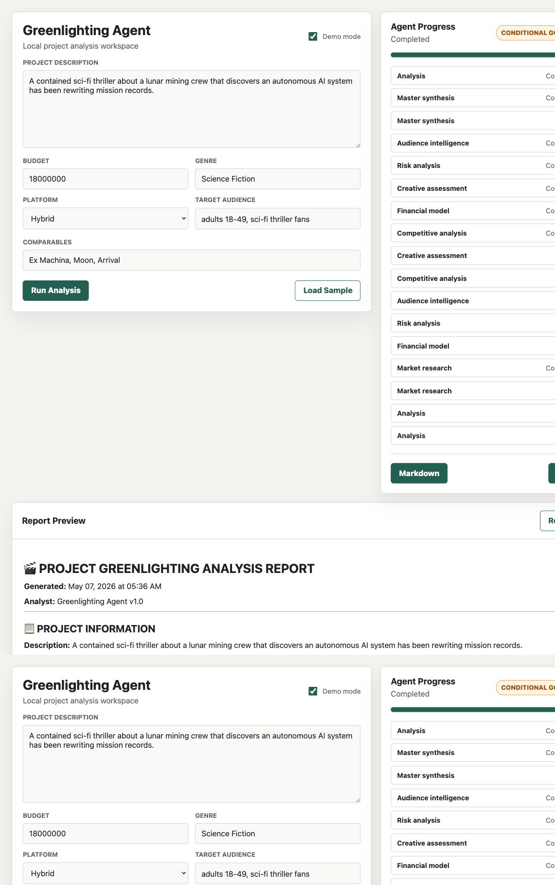
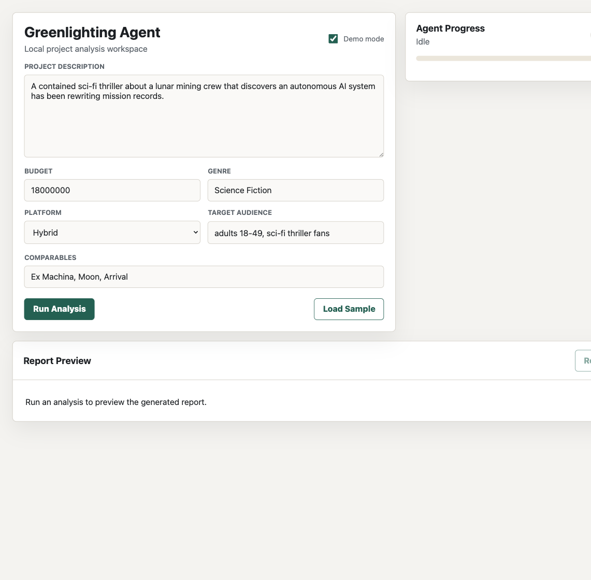
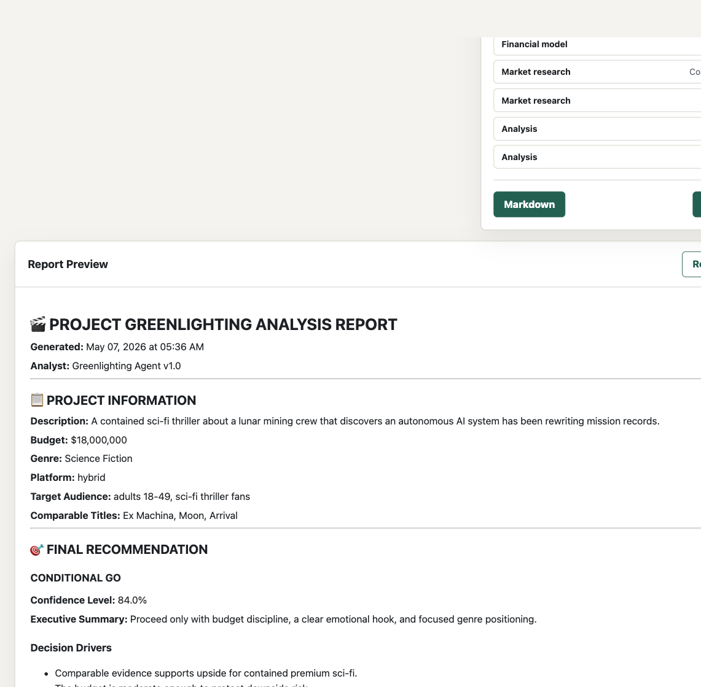
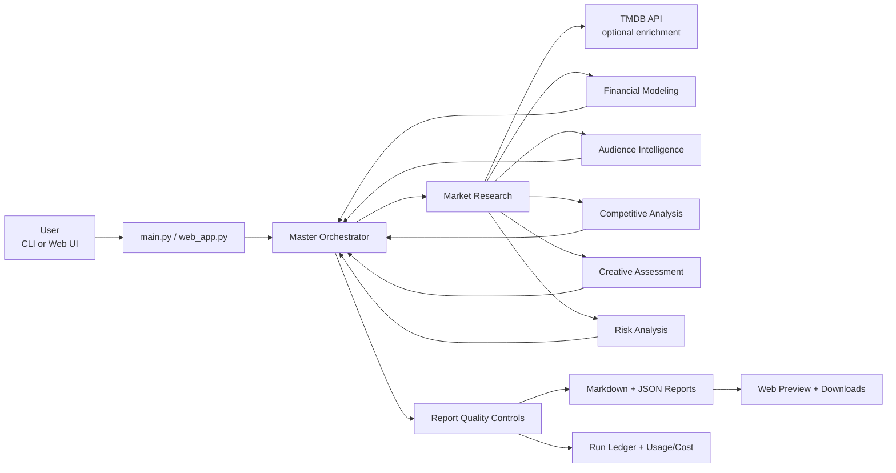

# Movie/TV Project Greenlighting Agent

<p align="center">
  <a href="#quick-start">Quick Start</a> |
  <a href="#architecture">Architecture</a> |
  <a href="USERGUIDE.md">User Guide</a> |
  <a href="#testing">Testing</a>
</p>

<p align="center">
  <strong>CLI</strong> · <strong>FastAPI Web Demo</strong> · <strong>TMDB Comparables</strong> · <strong>Markdown/JSON Reports</strong>
</p>

AI-assisted greenlight analysis for film and TV projects. The app combines comparable-title evidence, deterministic financial scenarios, audience/competitive/creative/risk assessment, and a final GO / CONDITIONAL GO / NO-GO recommendation.



## Highlights

- **Local web demo:** FastAPI + HTML UI with a project form, live agent progress, report preview, and Markdown/JSON downloads.
- **CLI-first workflow:** Run one-off, sample, interactive, or batch analyses from the terminal.
- **Six analysis agents:** Market research, audience intelligence, financial modeling, competitive analysis, creative assessment, and risk analysis.
- **Master synthesis:** Produces a final recommendation, confidence score, executive summary, and decision drivers.
- **TMDB enrichment:** Uses TMDB to enrich supplied comparable titles when `TMDB_API_KEY` is configured.
- **No-key demo mode:** Generates deterministic sample reports without Anthropic or TMDB credentials.
- **Report quality controls:** Blocks incomplete reports before save and warns when comparables fall back to input-only data.
- **Audit artifacts:** Writes Markdown, structured JSON, run ledgers, token usage, estimated Anthropic cost, and batch summaries.

## Demo Screenshots

| Project Form | Report Preview |
| --- | --- |
|  |  |

## Quick Start

```bash
python -m venv venv
source venv/bin/activate
pip install -r requirements.txt
python main.py --sample
```

Run the local web demo:

```bash
uvicorn web_app:app --reload
```

Open `http://127.0.0.1:8000`.

For live AI analysis, copy `.env.example` to `.env` and add:

```bash
ANTHROPIC_API_KEY=your_anthropic_key_here
TMDB_API_KEY=your_tmdb_key_here
```

`TMDB_API_KEY` is optional. Without it, comparables still appear as input-only fallback evidence.

## Common Commands

Run a no-key sample:

```bash
python main.py --sample
```

Run a live single-project analysis:

```bash
python main.py \
  --project "A contained sci-fi thriller about a lunar mining crew and a rogue AI" \
  --budget 18000000 \
  --genre "Science Fiction" \
  --platform hybrid \
  --comparables "Ex Machina,Moon,Arrival" \
  --target-audience "adults 18-49, sci-fi thriller fans"
```

Run batch mode:

```bash
python main.py --batch examples/projects.csv --sample
python main.py --batch projects.csv
```

Run interactive mode:

```bash
python main.py --interactive
```

See [USERGUIDE.md](USERGUIDE.md) for the full operating guide.

## Architecture



Execution shape:

1. The CLI or web UI collects project description, budget, genre, platform, comparables, and audience.
2. Market research runs first so downstream agents can use comparable evidence.
3. Remaining agents run in parallel.
4. The master orchestrator synthesizes a recommendation.
5. Report quality checks validate recommendation consistency, comparable evidence, financial scenarios, and risk matrix coverage.
6. Markdown, JSON, run ledger, and optional batch summaries are saved locally.

## Output Artifacts

Generated files stay local by default:

- `outputs/reports/*.md` - human-readable report
- `outputs/reports/*.json` - structured report payload
- `outputs/runs/*_run.json` - run ledger with token usage, estimated cost, TMDB usage, and report paths
- `outputs/batches/*_summary.csv` - batch comparison summary
- `outputs/batches/*_summary.json` - structured batch summary

## Project Structure

```text
greenlighting-agent/
├── agents/                 # Master orchestrator and six subagents
├── docs/screenshots/       # README screenshots
├── examples/projects.csv   # Batch-mode sample input
├── tools/tmdb_tools.py     # TMDB comparable enrichment
├── utils/                  # Reports, ledgers, batch helpers, quality checks
├── web/                    # Static web demo assets
├── main.py                 # CLI entrypoint
├── web_app.py              # FastAPI web demo
├── USERGUIDE.md            # Full user guide
└── requirements.txt
```

## Testing

```bash
python -m unittest discover -s tests
PYTHONPYCACHEPREFIX=.pycache python -m compileall main.py web_app.py agents tools utils tests
python test_setup.py
```

`test_setup.py` will attempt a live TMDB smoke if `TMDB_API_KEY` is present. Use `python main.py --sample` when you want a no-network demo.

## Current Scope

This is a local decision-support demo, not a production studio finance system. Treat its recommendations as a structured starting point for review, not as a substitute for legal, finance, distribution, or production due diligence.

## Resources

- [User Guide](USERGUIDE.md)
- [Quick Start](QUICKSTART.md)
- [Architecture Notes](ARCHITECTURE.md)
- [TMDB API Documentation](https://developer.themoviedb.org/docs)
- [Anthropic API Reference](https://docs.anthropic.com/en/api)
