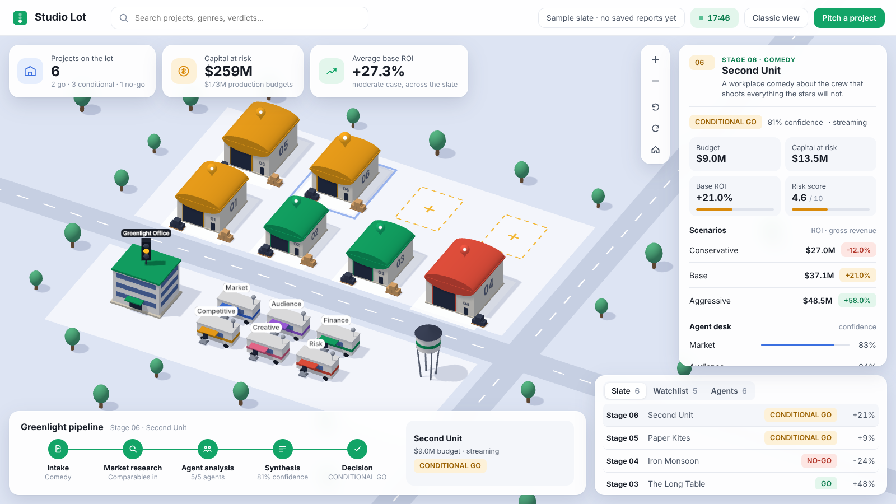

# Studio Lot View

## Human Review

Producer decisions are persisted in the local workspace SQLite database with a
foreign key to the exact project/version. Records are append-only; corrections
are new decisions, preserving the previous entry. A fresh analysis version does
not inherit approval. AI report payloads and recommendations remain unchanged.

`POST /api/projects/{id}/decisions` accepts `version`, `status` (Approved, Hold,
Rework, Passed), `reviewer`, `notes`, and optional `conditions`. The workspace
detail includes the decision history. Project summaries include `human_decision`
for the current version and `previous_decision` for historical context. The schema
is created additively for existing workspace databases. Decisions are local,
unauthenticated records; conditions do not trigger enforcement or spending.

## Overview

The project detail panel now includes milestone snapshots/history, evidence
provenance, and financial stress controls from `web/project-tools.js`. These use
the backend APIs documented in [ARCHITECTURE.md](ARCHITECTURE.md#added-api-contracts).
Milestones are project-level recorded progress; producer decisions remain
version-specific. Stress signals never change soundstage verdict colours.
Stored and legacy evidence are displayed without inventing missing dates or
links. Sample-only illustrative stages do not expose saved-project tools.

The Studio Lot is an isometric, strategy-game style view of the greenlight slate. It is a second front end over the same local API as the classic view; it adds no agent logic of its own.



## Open it

```bash
uvicorn web_app:app --reload
```

Then open `http://127.0.0.1:8000/lot`. No API keys are needed: with no saved reports the lot shows a labelled sample slate, and "Pitch a project" runs in demo mode by default.

## What you are looking at

| On the lot | What it is | Where the data comes from |
| --- | --- | --- |
| Soundstage | One saved report. Roof colour is the verdict, size follows budget, the number is its stage slot. | `/api/reports` |
| Map pin and blue outline | The verdict again, and the currently selected project. | `/api/reports` |
| Vacant pad | An empty slot. Click it to pitch a project. | – |
| Agent trailers | The analysis agents. The lamp is grey when idle, blue while working, green when done. | Job events from `/api/jobs/{id}/events` |
| Carts | An agent delivering its finished report to the office during a live run. | Job events |
| Greenlight Office | The master orchestrator. Its signal shows the selected project's verdict and cycles during synthesis. | Job events and `/api/reports` |
| Top cards | Slate totals: project count, capital at risk, average base ROI. | `/api/slate-dashboard` |
| Right panel | The selected project: numbers, scenarios, agent confidence, decision drivers, brief and package links. | `/api/reports/{id}` |
| Bottom-left pipeline | Intake, market research, agent analysis, synthesis, decision, for the selected project or the live run. | Job events and `/api/reports/{id}` |
| Bottom-right tabs | Slate (newest first), Watchlist (highest risk), Agents (status and confidence). | `/api/reports`, `/api/slate-dashboard` |

Controls: drag to pan, scroll to zoom, and use the map buttons to zoom, rotate a quarter turn, or reset. Search jumps to a project by name, genre, platform, or verdict.

## What updates on its own, and what does not

The lot reads the API every time it loads and again after each run, so anything that is **data** appears without touching the lot's code. Anything that is a **new concept** needs a small edit, because the lot only draws what it has been told about.

| You change | Does the lot follow automatically? | What to do |
| --- | --- | --- |
| More reports, different verdicts, budgets, ROI, risk | Yes | Nothing. |
| Values inside fields the lot already shows | Yes | Nothing. |
| Prompts, models, or the internal logic of an agent | Yes | Nothing. |
| Add, remove, or rename an agent | No, and a test fails until you do | [Add an agent](#add-an-agent) |
| Add a field to the report that people should see | No | [Show a new report field](#show-a-new-report-field) |
| Rename or remove a field the lot reads | No, the value silently shows as `n/a` or `–` | Update the [data contract](#data-contract) fields in `web/lot.js` |
| Add a verdict beyond GO / CONDITIONAL GO / NO-GO | No, it renders grey as "unrated" | [Add a verdict](#add-a-verdict) |
| Add a pipeline stage or a new progress event | No, the event is ignored | [Add a pipeline step](#add-a-pipeline-step) |
| Want a new kind of object on the map | No | [Add something to the map](#add-something-to-the-map) |
| Add a field to the pitch dialog | No | [Add a pitch input](#add-a-pitch-input) |

## How the code is split

| File | Responsibility |
| --- | --- |
| `web/lot.html` | Page structure: top bar, cards, panels, pitch dialog. |
| `web/lot.css` | All styling for the panels. Colours are CSS variables at the top. |
| `web/lot.js` | Data and panels: fetches the API, holds state, renders every HTML panel, runs the live-run playback. |
| `web/lot-scene.js` | The 3D lot only: builds models, handles camera, hover, and clicks. It knows nothing about the API. |
| `web/vendor/three.module.min.js` | Three.js r170, vendored so the page works offline. |
| `web_app.py` | Serves the page at `/lot`. |

The rule that keeps this maintainable: `lot.js` decides *what* to show and calls the scene; `lot-scene.js` decides *how it looks*. The scene exposes seven calls: `setProjects`, `select`, `setAgentState`, `dispatchCourier`, `setSignal`, `setInsets`, `control`.

## Recipes

### Add an agent

1. Add the agent to `self.subagents` in `agents/master_agent.py` as usual.
2. Add one line to the `AGENTS` list at the top of `web/lot.js`, using the same key:

   ```js
   { key: "legal_review", short: "Legal", name: "Legal review" },
   ```

That is all. The trailer, lamp, label, courier cart, the Agents tab row, the confidence row in the right panel, and the "n/n agents" pipeline text all come from that list.

`tests/test_core.py::test_studio_lot_agent_roster_matches_orchestrator` fails if the two lists disagree, so a forgotten step 2 is caught by the test suite.

Trailers are laid out three per row. A seventh agent starts a third row at the front edge of the lot; beyond nine, adjust the trailer grid in `web/lot-scene.js` (search for `TRAILER_SCALE`).

### Show a new report field

Decide where it belongs:

- **Right panel:** edit `renderDetail` in `web/lot.js`. Summary fields (from `/api/reports`) are on `report`; the full saved JSON is on `payload`.
- **A list row:** edit `renderRoster` in `web/lot.js`.
- **A top card:** add the card in `web/lot.html` and fill it in `renderKpis`. Slate-wide numbers should be computed in `utils/slate_dashboard.py`, not in the browser.
- **Searchable:** add the field to the array in `runSearch`.

If the field is not yet in the summary, add it to `_summary_from_payload` in `utils/report_library.py`.

Always pass text through `esc(...)` before putting it in a template string; report text is user input.

### Add a verdict

1. `verdictKey` in `web/lot.js`: map the new recommendation string to a short key.
2. `COLORS` in `web/lot-scene.js`: add a roof colour under that key.
3. `web/lot.css`: add `.badge[data-v="yourkey"]` and `.meter i[data-v="yourkey"]` colours.
4. `utils/slate_dashboard.py`: add it to the recommendation counts so the top card includes it.

### Add a pipeline step

1. Emit the event from the orchestrator with `_emit_progress(stage, name, status)`.
2. In `web/lot.js`, add the step to the `steps` arrays in `renderTracker`, an icon to `STEP_ICONS`, and a branch for the new `event.stage` in `applyRunEvent`.

Events arrive within milliseconds in demo mode, so `applyRunEvent` is fed through a queue that plays one event every `EVENT_PACING_MS` (520 ms). Keep new events on that queue or they will flash past.

### Add something to the map

Work in `web/lot-scene.js`:

1. Write a builder next to `buildStage`, `buildTruck`, or `buildCart`, using the `box`, `cyl`, `flat`, and `label` helpers.
2. If it should be clickable, call `register(group, { kind: "yourkind", id })`, then handle that `kind` in the `onPick` and `onHover` handlers in `web/lot.js`.
3. If it should animate, add it to the `frame` loop and skip the motion when `reducedMotion` is true.
4. If `lot.js` needs to drive it, add a function to the object returned by `createLot`.

### Add a pitch input

1. Add the input to the `<dialog id="pitch">` form in `web/lot.html`.
2. Add it to the request `body` in the `pitchForm` submit handler in `web/lot.js`.
3. If it is a new API field, add it to `AnalysisRequest` in `web_app.py`.

Marketing spend is the model to copy: a blank box is left out of the request so the finance model applies its own default, and only a typed number is sent.

### Change the limits

| Setting | Where | Default | Note |
| --- | --- | --- | --- |
| Soundstages shown | `MAX_STAGES` in `web/lot.js` | 12 | The scene has 12 slots (4 columns × 3 rows). To show more, also extend `SLOT_COLUMNS` / `SLOT_ROWS` in `web/lot-scene.js`. |
| Reports fetched | `REPORT_LIMIT` in `web/lot.js` | 100 | The API caps `limit` at 100. The first card shows "100+" at the cap. |
| Live-run pacing | `EVENT_PACING_MS` in `web/lot.js` | 520 | Purely cosmetic. |
| Default camera | `ELEVATION`, `HOME_AZIMUTH` in `web/lot-scene.js` | 38°, 28° | The view re-fits itself to the free area between the panels. |

## Data contract

These are the fields the lot reads. Renaming one on the backend without updating `web/lot.js` will not raise an error; the value just goes blank.

**Report summary** (`/api/reports`): `id`, `generated_at`, `project_name`, `description`, `budget`, `genre`, `platform`, `recommendation`, `confidence`, `moderate_roi`, `total_exposure`, `risk_level`, `overall_risk_score`.

**Report payload** (`/api/reports/{id}` → `payload`): `scenario_comparison[].case`, `.base_roi`, `.base_gross_revenue`; `subagent_results[agent_key].confidence`; `decision_drivers[]`; `project.comparables[]`.

**Slate dashboard** (`/api/slate-dashboard`): `report_count`, `recommendation_counts`, `total_budget`, `total_exposure`, `average_roi`, `top_projects[].id`, `watchlist[].id`.

**Job events** (`/api/jobs/{id}/events`): `stage` is `job`, `agent`, or `synthesis`; `name` is the agent key for agent events; `status` is `queued`, `started`, `completed`, or `failed`.

## Keeping it in step with new features

- **Tests.** `python -m unittest discover -s tests` covers that `/lot` and its assets are served, and that the lot's agent list matches the orchestrator.
- **Checklist for any backend feature.** Ask: does this add an agent, a report field people should see, a verdict, or a pipeline stage? If yes, follow the matching recipe above in the same change.
- **Working with a coding agent.** `AGENTS.md` at the repo root tells Codex, Claude Code, and similar tools to check this file whenever they change agents, the report shape, or progress events. When you ask for a feature, adding "and show it in the Studio Lot view" is still the clearest instruction.
- **Screenshot.** If the look changes noticeably, replace `docs/screenshots/studio-lot.png`.

## Known limits

- The lot shows the newest 12 reports; older ones are reachable from the classic view's report history, not from the lot.
- Stage numbers follow age among the reports shown, so they shift down by one when a new report pushes the oldest off the lot.
- Demo mode always returns CONDITIONAL GO, so a slate built only from demo runs is all amber.
- Light theme only. On narrow screens the panels stack below the map.
- The sample slate appears only while there are no saved reports, and is labelled as a sample.
# Project Workspaces

New analyses started from the web UI have a persistent project identity. In the
pitch dialog, enter an optional project name and version name. Select a saved
soundstage and use **Reanalyze** to revise its logline, budget, comparables,
audience, financial assumptions, or treatment. Settings not exposed in the
dialog (including private dataset selection) are preserved from the prior run.
Demo/live mode is also preserved; check it before submitting a revision.

The detail panel lists named versions, opens older version briefs, and compares
any two versions' inputs, budget, capital at risk, base ROI, risk, confidence,
and verdict. Numeric changes are after minus before; ROI differences are
percentage points. These are observed changes, not proof that one input caused
the verdict change.

Each linked project occupies one soundstage using its latest completed version.
Lot totals count projects once. The original report library and report-based
dashboard remain available at `/` and retain every analysis. Legacy and CLI/batch
reports remain standalone until Reanalyze, producer review or milestone tracking
links one into a workspace.
Failed analyses do not add a version. Existing Markdown/JSON files are untouched.

Workspace metadata and full reanalysis inputs (including treatment text) are
stored locally in `outputs/projects/workspaces.sqlite3`, excluded from Git.
Keep this database together with `outputs/reports/` when backing up or moving
the app. Older reports only retain treatment excerpts; the app warns when the
full treatment must be pasted again. Do not expose this unauthenticated local
app publicly; workspace inputs may be confidential.

API: `GET /api/projects`, `POST /api/projects` (adopt a saved report),
`GET /api/projects/{id}`, and
`GET /api/projects/{id}/compare?before=1&after=2`.
`POST /api/analyze` accepts `workspace_id`, `project_name`, and `version_label`.
