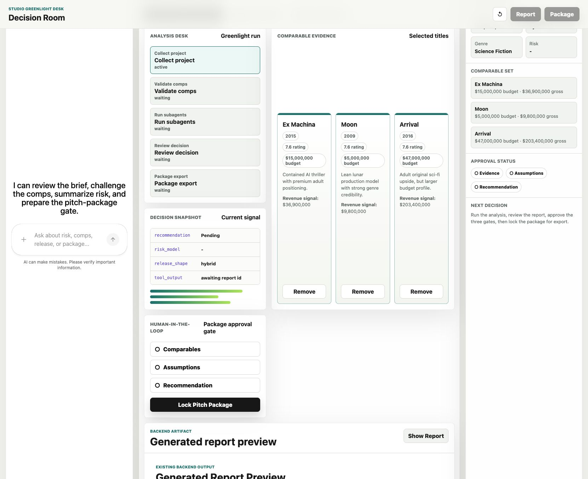
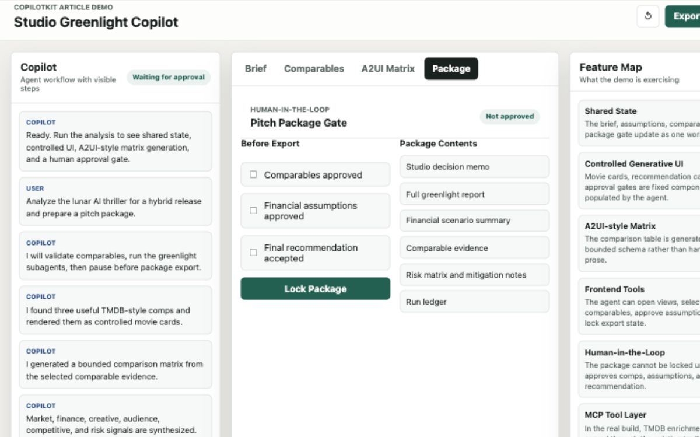
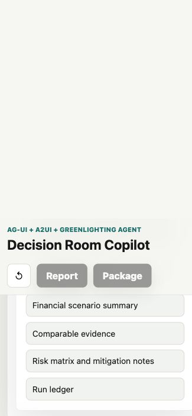
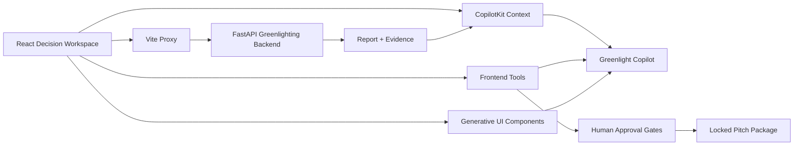

# Studio Greenlight Copilot

A React + CopilotKit decision-room UI for the Greenlighting Agent backend.

The app uses live CopilotKit packages:

- `@copilotkit/react-core@1.57.3` through the current `@copilotkit/react-core/v2` exports
- `CopilotKitProvider`, `CopilotChat`, `useAgentContext`, `useComponent`, and `useFrontendTool`
- a local AG-UI agent for no-key sidebar runs, or an LLM-backed CopilotKit runtime via `VITE_COPILOTKIT_RUNTIME_URL`
- Vite proxy calls into the existing Greenlighting FastAPI backend
- human approval gates before package export

## Run With The Existing Backend

Start the Greenlighting Agent backend from the existing repo:

```bash
source venv/bin/activate
uvicorn web_app:app --host 127.0.0.1 --port 8000
```

Start this CopilotKit demo:

```bash
cd copilotkit-demo
npm install
npm test
npm run dev
```

Open `http://127.0.0.1:5173`.

The Vite server proxies `/greenlight-api/*` to `http://127.0.0.1:8000/api/*`.

## Screenshots

| Decision Room | Package Gate |
| --- | --- |
|  |  |

| Mobile Decision Room |
| --- |
|  |

## Architecture



## Copilot Runtime

By default the sidebar runs through `src/localGreenlightAgent.ts`, a local AG-UI agent registered with `agents__unsafe_dev_only`. This avoids a fake runtime endpoint and keeps the demo usable without API keys.

To make the sidebar call a real LLM-backed CopilotKit runtime, copy the env template and add an OpenAI key:

```bash
cp .env.example .env.local
# edit .env.local and set OPENAI_API_KEY
```

This demo can also reuse an existing Greenlighting Agent `.env` if it contains `ANTHROPIC_API_KEY`. For a portable setup, set:

```bash
GREENLIGHT_ENV_FILE="/path/to/greenlighting-agent/.env"
```

Start the CopilotKit runtime:

```bash
npm run copilot:runtime
```

In a second terminal, start the React app in runtime mode:

```bash
npm run dev:runtime
```

Runtime health check:

```bash
curl -s http://127.0.0.1:4010/health
```

If no LLM API key is configured, the runtime still starts and the chat explains that a key is missing. For no-key demos, use `npm run dev` and the local fallback agent.

If both `OPENAI_API_KEY` and `ANTHROPIC_API_KEY` are present, the runtime uses OpenAI by default. If only `ANTHROPIC_API_KEY` is present, it uses Anthropic with `MODEL_NAME`.

The backend greenlight workflow remains separate: Vite proxies `/greenlight-api/*` into the existing FastAPI app.

## Integration Notes

This folder is intentionally isolated from the Python/FastAPI app:

- keep `vite.config.ts` proxy during local development
- set `VITE_GREENLIGHT_API_BASE=/api` if served by the FastAPI app directly
- keep generated folders ignored: `node_modules/`, `dist/`
- preserve the existing backend endpoints: `/api/analyze`, `/api/jobs/{job_id}`, `/api/jobs/{job_id}/events`, `/api/jobs/{job_id}/report`, and `/api/reports/{report_id}/package`
